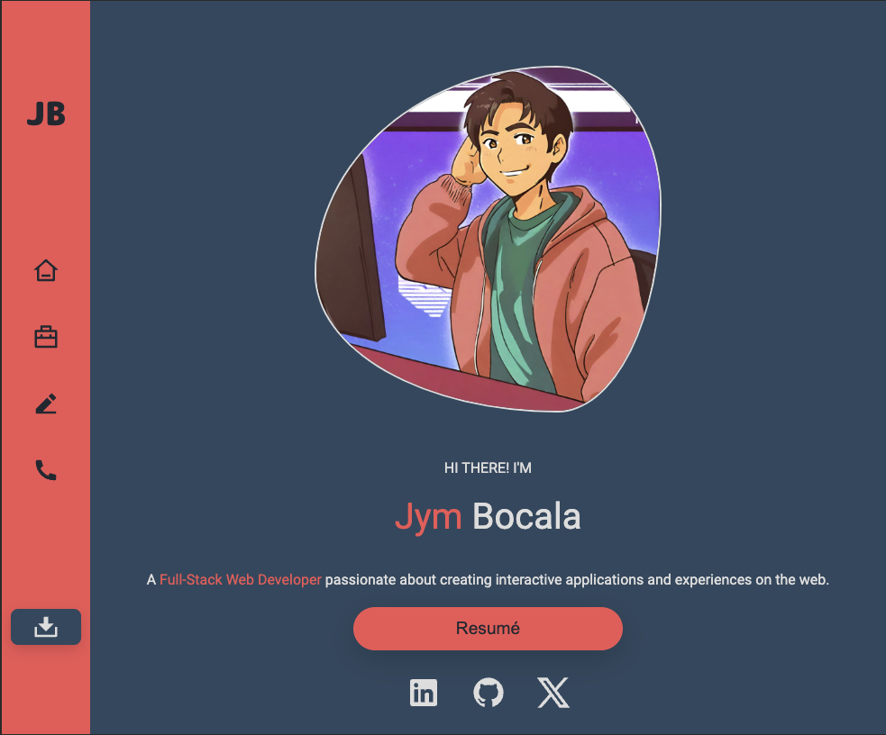

A link (URL) to your published portfolio website
A link to your GitHub repo
Description of your portfolio website, including,
Purpose
Functionality / features
Sitemap
Screenshots
Target audience
Tech stack (e.g. html, css, deployment platform, etc)

# Jym Bocala Portfolio Site

### [Live Site 🔗](https://iridescent-nougat-1d4782.netlify.app)
### [GitHub Repository 🔗](https://github.com/jymbocala/ca-portfolio)

## Description

### Purpose
As an aspiring developer, I'm well aware of the importance of showcasing my skills to potential employers. That's why I've created my personal portfolio website. It's my digital canvas where I can display my talents, highlight my proficiencies, and demonstrate my coding expertise.

My portfolio website's main goal is to establish a strong online presence as a dedicated developer and IT professional. It provides insights into my background, skills, interests, and professional knowledge. Additionally, it showcases my completed projects, illustrating my capabilities and accomplishments effectively.

### Functionality / features
Features for this site include:

Custom navigation bar for mobile devices using a button to toggle a show and hide for the mobile navigation.
Navigation bar also transforms into a side bar for larger device layouts.
Use of reusable components such as the navbar, footer, project cards, and blog cards.

### Sitemap

  

### Screenshots

  
  
  

### Target Audience
My target audience for this portfolio website primarily consists of potential employers seeking a skilled developer or IT professional. I understand their expectations, which include a solid understanding of technology, programming languages, and high standards for professionalism and work ethic. With this portfolio, I aim to prove that I'm the right fit for their teams.

### Tech stack
The technology stack used in the process of creating this site includes:

HTML5: Used for structuring the website's content.
CSS: Used for styling and layout.
SASS: A CSS preprocessor for enhanced styling capabilities.
Git: Used for version control and collaboration.
